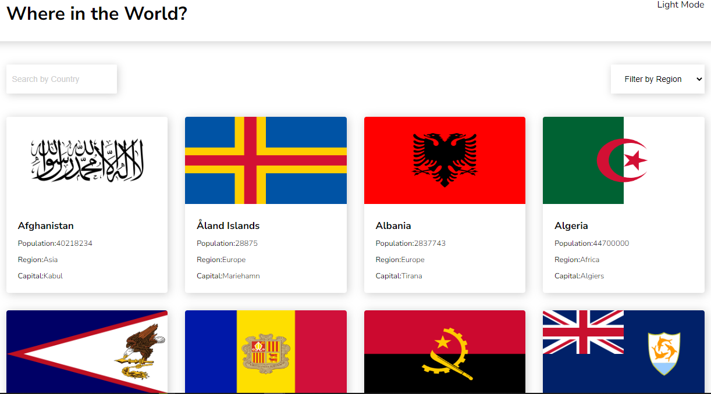

# REST Countries API with React and TypeScript

A single-page application built with React and TypeScript that allows users to search for countries and view their details.

## Demo

[View Demo](https://amoatey-rest-api-countries.netlify.app/)

## Technologies Used

- React
- TypeScript
- Vite
- React Router
- Axios
- Styled Components
- Rest Countries API

## Getting Started

1. Clone the repo: `git clone https://github.com/your-username/rest-countries-api.git`
3. Install dependencies: `npm install`
5. Run the app: `npm run dev`
7. Open [http://localhost:3000](https://amoatey-rest-api-countries.netlify.app/) in your browser.

## Features

- Search for countries by name or region
- Filter countries by region
- View country details including name, flag, population, languages, and currencies
- View neighboring countries

## Screenshots

## Contributing

Contributions are welcome! Feel free to open a pull request.

